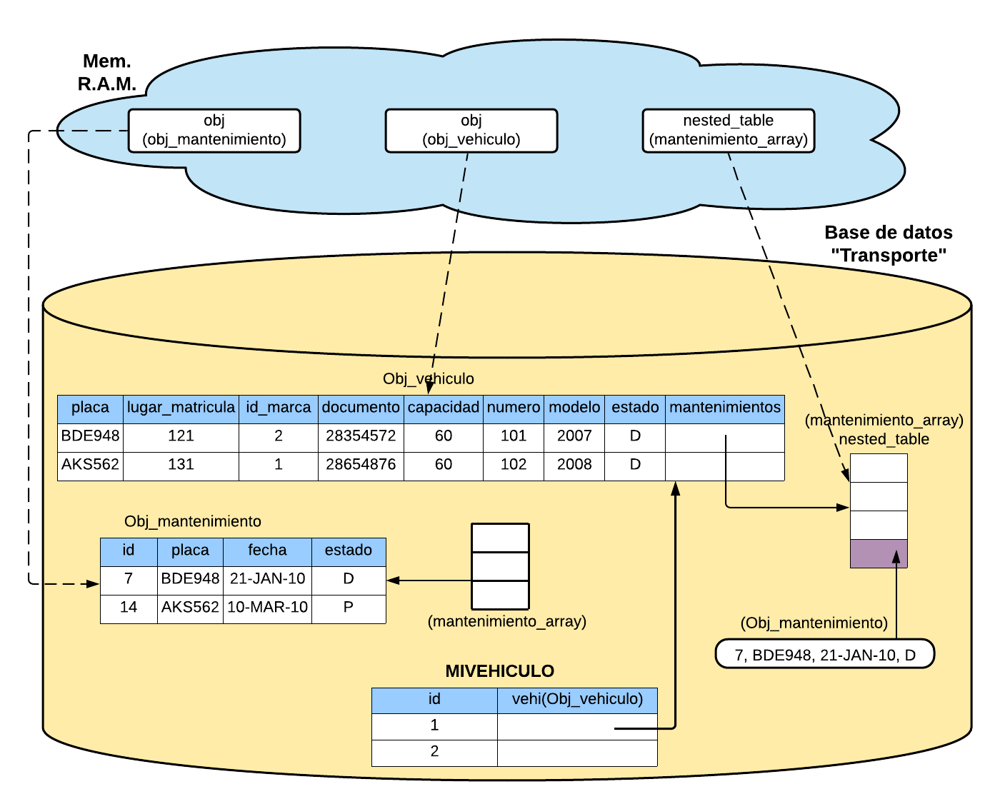

# Base de datos orientada a objetos

## Contenido
* [Enunciado](#enunciado)
  * [Modelo Relacional](#modelo-relacional)
  * [Modelo objetos](#modelo-objetos)
* [¿ Cómo usar este proyecto ?](#usar-este-proyecto)
  * [Construir la base de datos](#construir-la-base-de-datos)
  * [Información de las tablas](#información-tablas)
* [Integrantes del grupo](#integrantes)

## Enunciado
Se debe migrar el modelo relacional a un modelo orientado a objetos, especificamente migrar las tablas **"Vehículos"**, **"Mantenimientos"** y **"Detalles"**, el modelo de clases es libre.

Metodos adicionales a la lógica de negocio:
- Total de deuda que tiene un vehículo (ingresa placa).
- Cambio de estado de una factura por pago de la misma (ingresa id_mantenimiento).
- Reporte total de mantenimientos de un vehículo. Se debe mostrar los detalles de cada uno
de estos mantenimientos (ingresa la placa del vehículo). Se deben imprimir también los
totales de cada factura a este reporte.

Se usó la base de datos Oracle, V. 11g.

### Modelo relacional
[Modelo Relacional](modelo.jpg)

### Modelo objetos


## Usar este proyecto
Para usar este proyecto primero se debe crear la estructura relacional de la base de datos, luego la estructura orientada a objetos, para luego probar el funcionamiento de las funciones solicitadas.
Como se uso la base de datos Oracle, se especificaran los detalles para la construcción usando este S.G.B.D.

### Construir la base de datos
1. Conectate como **"System"** y crea la base de datos (usuario)
```
CREATE USER transporte IDENTIFIED BY password;
```
Es posible que tengas que otorgarle [permisos](https://stackoverflow.com/questions/9447492/how-to-create-a-user-in-oracle-11g-and-grant-permissions)
Conectate luego de crearlo

2. Clona el proyecto
```
git clone https://github.com/augusticor/oodb-transporte.git
```

3. Inicia la terminal de **SQL PLUS** en el directorio donde clonaste el proyecto, esto para que detecte los scripts que estan en la carpeta raíz del proyecto, ó también puedes llamarlos usando la ruta absoluta.

4. Desde la terminal de **SQL PLUS** ejecuta el script [creasistema.sql](creasistema.sql) para crear las tablas y sus respectivos "constraints"
```
start creasistema.sql;
```

5. LLena las tablas con los "insert", usando el archivo [llenatablas.sql](llenatablas.sql), es posible que tengas que correrlo más de una vez para que se complete con éxito el llenado de tablas, puedes verificar la cantidad de registros mirando la [Información de las tablas](#información-tablas)
```
start llenatablas.sql;
```

6. Finalmente persistir la información haciendo "commit"
```
commit;
```

### Información tablas
|  Nombre Tabla  	| Número de Tuplas 	|
|:--------------:	|:----------------:	|
|    personas    	|        30        	|
|    contratos   	|        25        	|
|     marcas     	|         8        	|
|    detalles    	|        99        	|
|     lugares    	|        13        	|
| mantenimientos 	|        20        	|
|      rutas     	|        22        	|
|    repuestos   	|        41        	|
|  asignaciones  	|        28        	|
|   recorridos   	|      17.068      	|
|    vehiculos   	|        16        	|


### Construir el modelo orientado a objetos
1. Construye el modelo relacional

2. Corre el script [create_model.sql](create_model.sql)
```
start create_model.sql;
```

3. Listo

## Integrantes
* [Oscar Rojas](https://github.com/augusticor)
* [Esteban Gutierrez](https://github.com/esteban2709)
